# Web Solution with WordPress

In this project, you’ll set up a basic WordPress-based web solution using two EC2 instances running RedHat or CentOS. One instance will act as the Web Server and the other as the Database Server, with WordPress connected to a remote MySQL database.

## Project Overview

- **Web Server**: EC2 instance to host WordPress.
- **Database Server**: EC2 instance to host MySQL.
- **OS**: RedHat or CentOS.

---

## Prerequisites

- AWS EC2 account with permissions to create instances and EBS volumes.
- A key pair for SSH access to EC2 instances.
- Basic knowledge of Linux commands.

---

## Part 1: Configure Storage for the Web Server

### 1. Launch Web Server EC2 Instance and Attach Volumes

- Launch an EC2 instance with RedHat or CentOS to serve as your Web Server.
- Create and attach three EBS volumes, each with a size of 10 GiB, to the instance.

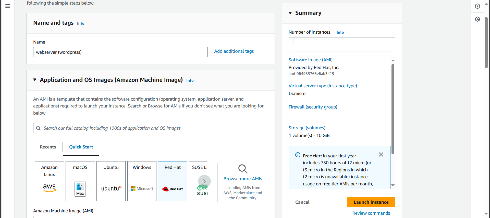

### SSH into the Instance and Verify Volumes

```bash
ssh -i keypair.pem ec2-user@<public-ip>
```

### Then launch your instance.

Confirm your volumes are up and in use.
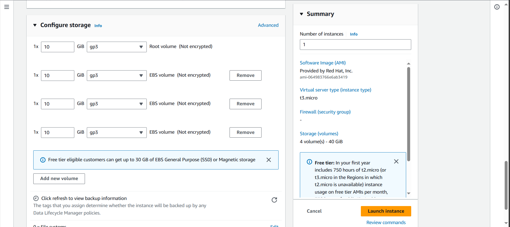

### List attached volumes

```bash
lsblk
```


### Partition the Volumes

```bash
sudo gdisk /dev/nvme1n1
```

- Type `n` to create a new partition, then accept the defaults.
- Repeat for the other volumes.


Install lvm2 package. Lvm2 is used for managing disk drives and other storage devices

```bash
sudo yum install lvm2
```

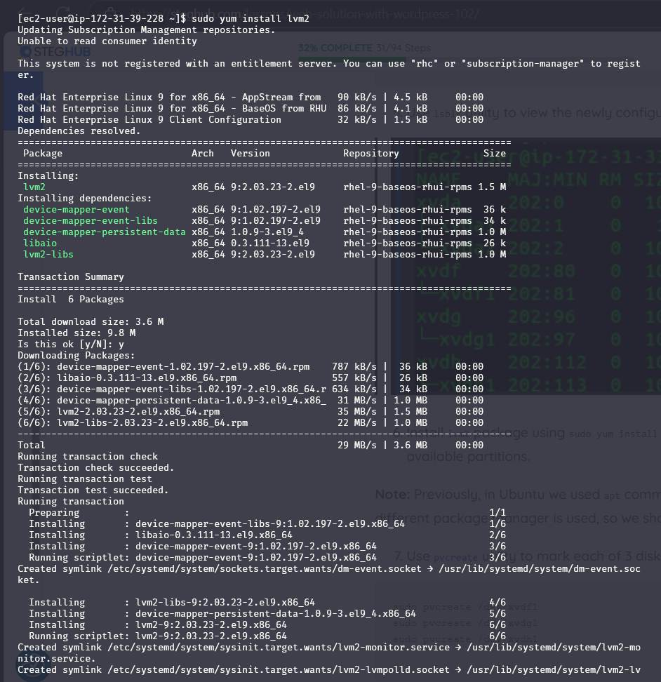

Run `sudo lvmdiskscan` to check for available partitions.
Use the pvcreate utility tool to mark each of the volumes as physical volumes

```bash
sudo pvcreate /dev/nvme1n1p1
sudo pvcreate /dev/nvme2n1p1
sudo pvcreate /dev/nvme3n1p1
```

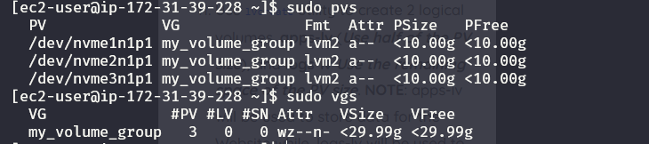

### Configure Logical Volumes

```bash
sudo pvcreate /dev/nvme1n1p1 /dev/nvme2n1p1 /dev/nvme3n1p1
sudo vgcreate my_volume_group /dev/nvme1n1p1 /dev/nvme2n1p1 /dev/nvme3n1p1
sudo lvcreate -n app-lv -L 14G my_volume_group
sudo lvcreate -n logs-lv -L 14G my_volume_group
```

Verify that the physical volume has been created `sudo pvs`


### Format and Mount the Logical Volumes

```bash
sudo mkfs -t ext4 /dev/my_volume_group/app-lv
sudo mkfs -t ext4 /dev/my_volume_group/logs-lv
sudo mkdir -p /var/www/html /home/recovery/logs
sudo mount /dev/my_volume_group/app-lv /var/www/html
sudo rsync -av /var/log/. /home/recovery/logs/
sudo mount /dev/my_volume_group/logs-lv /var/log
```


#### Verify the setup by running sudo vgs

```bash
sudo vgs

```

Create 2 logical volumes; app-lv and logs-lv.

```bash
sudo lvcreate -n app-lv -L 14G webdata-vg
sudo lvcreate -n logs-lv -L 14G webdata-vg
```

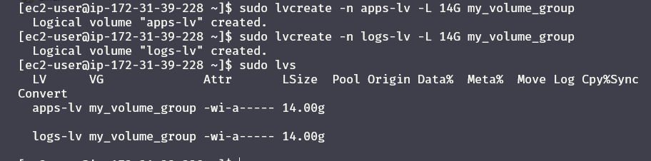
Verify that the logical volumes has been created `sudo lvs`

Verify the entire setup to be sure all has been configured properly

```bash
sudo vgdisplay -v #view complete setup - VG, PV, and LV
sudo lsblk
```

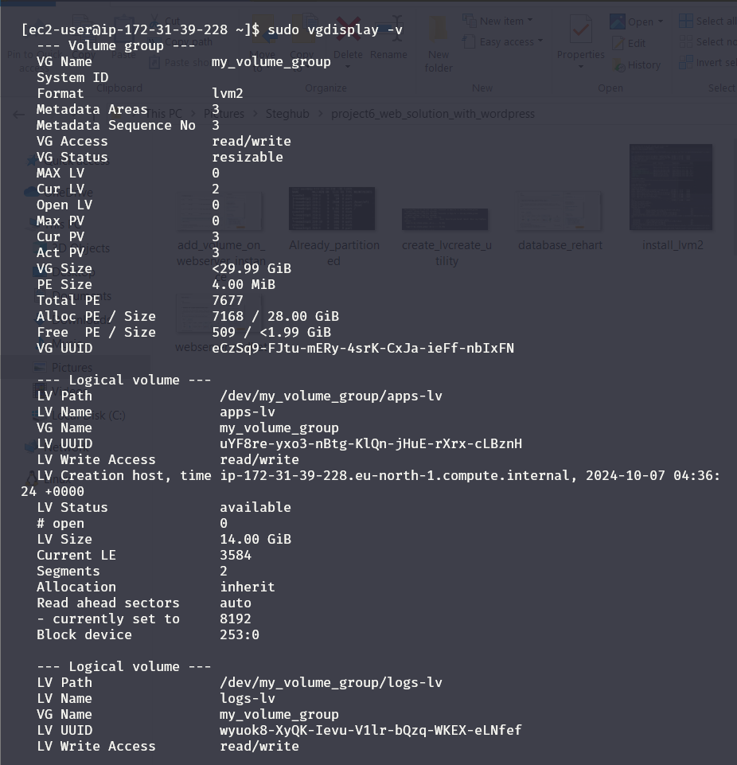

format the logical volumes using ext4 filesystems

```bash
sudo mkfs -t ext4 /dev/webdata-vg/apps-lv
sudo mkfs -t ext4 /dev/webdata-vg/logs-lv
```

Create a directory to store website file

```bash
sudo mkdir -p /var/www/html
```

Create another directory for the log files

```bash
sudo mkdir -p /home/recovery/logs
```

Mount the newly created directory for website files on the app logical volume we earlier created

```bash
sudo mount /dev/webdata-vg/apps-lv /var/www/html/
```

Back up all the files on the logs logical volume before mounting, this is done using rsync utility

```bash
sudo rsync -av /var/log/. /home/recovery/logs/
```

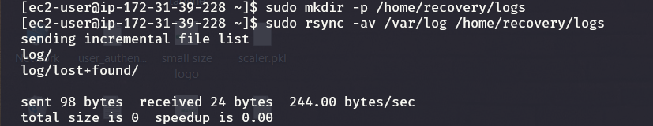

## Part 2: Configure MySQL on the Database Server

### 1. Launch Database Server EC2 Instance and Configure Storage

- Launch a new EC2 instance with RedHat or CentOS as your Database Server.
- Follow the same steps as in Part 1 to create and mount volumes on the Database Server, but use the directory `/db` and logical volume `db-lv`.


### 2. Install and Configure MySQL

```bash
sudo yum install -y mysql-server
sudo systemctl start mysqld
sudo systemctl enable mysqld
```


### 3. Create a MySQL User for WordPress

```sql
CREATE DATABASE wordpress;
CREATE USER 'wordpress_user'@'<web-server-ip>' IDENTIFIED BY 'your_password';
GRANT ALL ON wordpress.* TO 'wordpress_user'@'<web-server-ip>';
FLUSH PRIVILEGES;
```


---

## Part 3: Install WordPress on the Web Server

### 1. Install Apache, PHP, and Dependencies

```bash
sudo yum install -y httpd php php-mysqlnd php-fpm
sudo systemctl start httpd
sudo systemctl enable httpd
```

Install php and all its dependencies

```bash
sudo yum install https://dl.fedoraproject.org/pub/epel/epel-release-latest-8.noarch.rpm

sudo yum install yum-utils http://rpms.remirepo.net/enterprise/remi-release-8.rpm

sudo yum module list php sudo yum module reset php

sudo yum module enable php:remi-7.4

sudo yum install php php-opcache php-gd php-curl php-mysqlnd

sudo systemctl start php-fpm

sudo systemctl enable php-fpm setsebool -P httpd_execmem 1
```


Restart Apache

```bash
sudo systemctl restart httpd
```

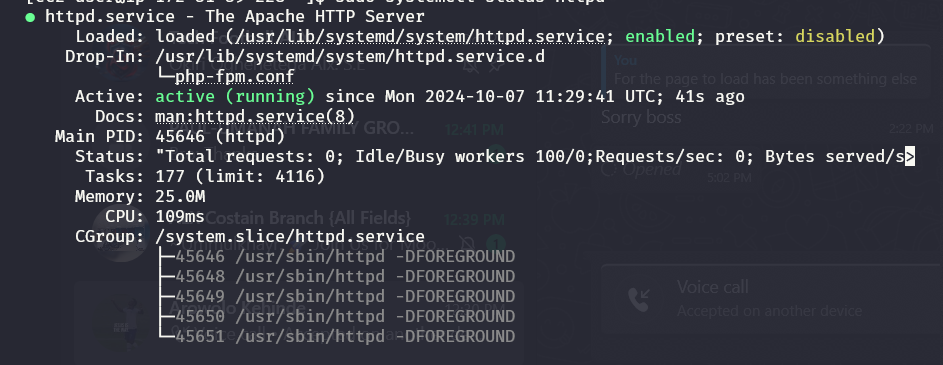

Create an info.php page to test if your configuration is correct

```bash
sudo vi /var/www/html/info.php
```

write the following code to check php config

```bash
<?php
phpinfo();
?>
```

Visit your IPaddress/info.php
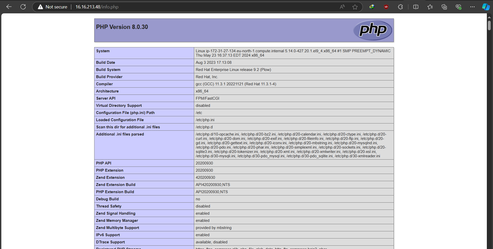
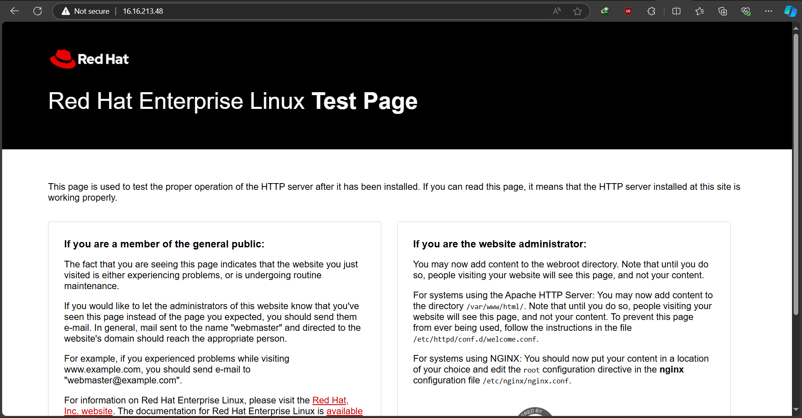

### 2. Download and Configure WordPress

```bash
wget http://wordpress.org/latest.tar.gz
tar xzvf latest.tar.gz
sudo cp -R wordpress/* /var/www/html/
sudo chown -R apache:apache /var/www/html/
```

### 3. Configure SELinux and Firewall for Apache

```bash
sudo setsebool -P httpd_can_network_connect=1
sudo firewall-cmd --zone=public --permanent --add-service=http
sudo firewall-cmd --reload
```

### 4. Finalize WordPress Installation

- Go to `http://<web-server-ip>/wordpress` to complete the WordPress setup in the browser.

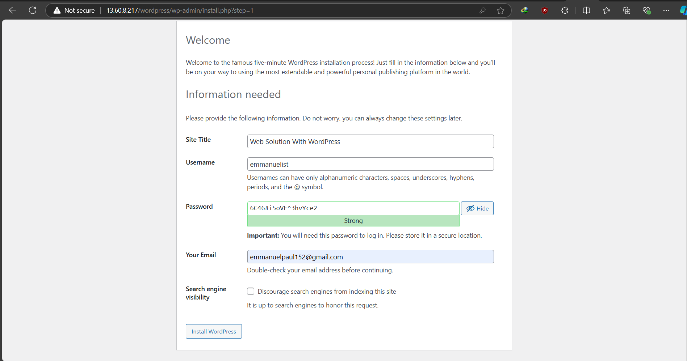

Site title for the site.
Username: \***\*
Password: \*\***
Your Email: \*\*\*\*
Discourage search engines from indexing this site:

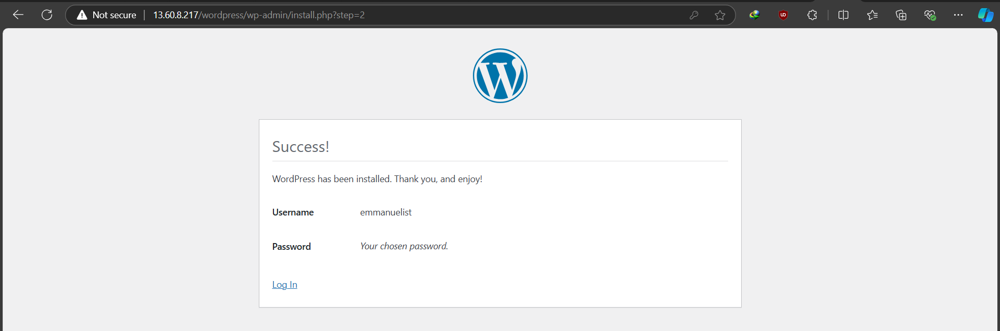

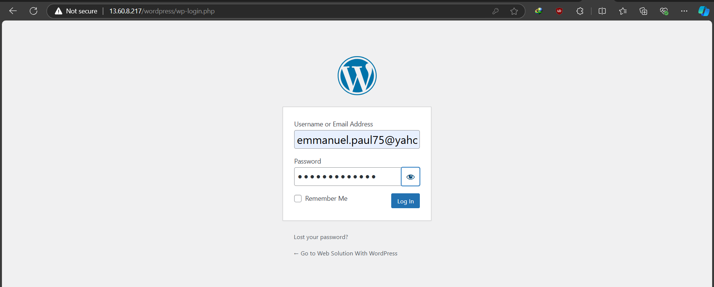

---

Congratulations! You have successfully deployed a WordPress website with a MySQL backend on AWS. Make sure to properly secure your instances and regularly backup your data.

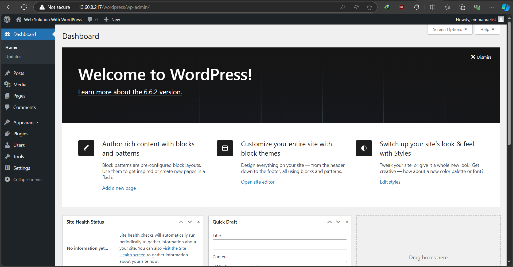
